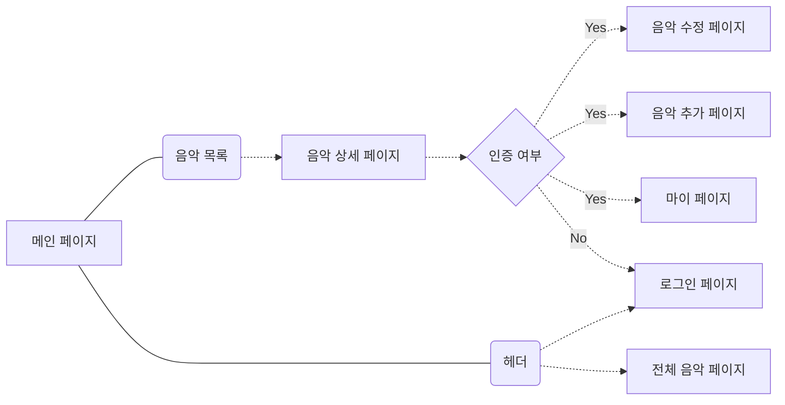

## Music-PT 소개

Music-PT는 Music Please Translation의 약어로, 음악을 번역하고 공부할 수 있는 웹사이트 입니다.
취미로 일본어 공부를 시작해 제일 높은 단계인 JLPT N1을 취득했지만 추가로 학습해야 할 한자와 단어는 무궁무진 했습니다. 이러한 부분은 시험 공부보다는 하나의 취미생활로서 조금씩 채워나가고 있습니다.
그 중 제가 좋아하는 한 가지 방법은 **'음악'** 을 통해 공부하는 것 입니다. K-POP의 경우 한국어 버전과 일본어 버전을 동시에 발매하는 경우가 잦습니다. 음악에 맞추기 위해 전체적인 내용은 비슷하지만 세세한 의미가 다르다는 것을 느끼고, 새로운 곡이 발매 되면 늘 두 곡의 가사를 비교하며 듣곤 했습니다.
가끔은 직접 번역해보기도 하면서 두 곡이 주는 가사의 미묘한 차이를 찾아내는 것이 재미있기도 했고, 이를 아카이빙 할면 좋겠다는 생각에 Music-PT 개발을 시작하게 되었습니다.

## 플로우 차트

## 사용한 언어/라이브러리
