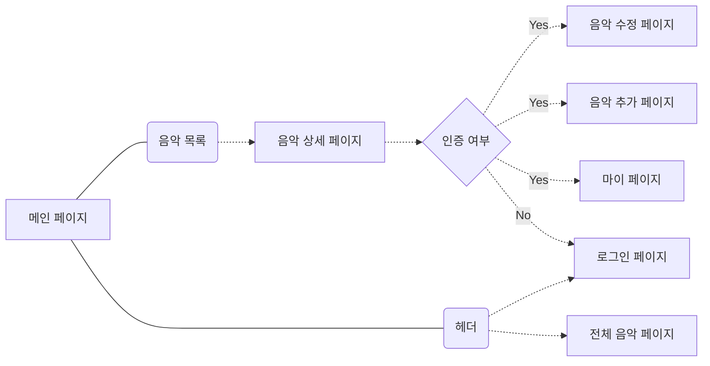

## Music-PT 소개

**Music-PT**는 Music-Please Translate!💽의 약어로, 음악을 번역하며 언어 공부를 할 수 있는 웹사이트입니다.   취미로 일본어 공부를 시작해, JLPT N1을 취득했지만 추가로 학습해야 할 한자와 단어는 늘 새롭게 등장하곤 했습니다. 새로운 단어를 공부할 때는 '공부'에 집중하기 보다는 '놀이'라고 생각하며, 하나의 취미생활로서 기억하는 단어의 범위를 조금씩 넓혀가고 있습니다. 그 중 제가 좋아하는 한 가지 방법은 '음악'을 통해 공부하는 것입니다. 그 예시로, K-POP의 경우 한국어 버전과 일본어 버전이 모두 존재하는 경우가 많습니다. 이 두가지 가사를 듣다보면 전체적인 가사 내용의 흐름은 비슷하지만, 음악과 발음을 맞추다보니 세세한 의미에 차이가 발생하기도 합니다. 이러한 미묘한 차이를 찾는 것이 즐거워 새로운 곡이 발매되면 늘 두 곡의 가사를 비교하며 듣곤 했는데, 이를 아카이빙 하면 좋겠다는 생각에 Music-PT 개발을 시작하게 되었습니다.

## 플로우 차트

## 사용한 언어/라이브러리
